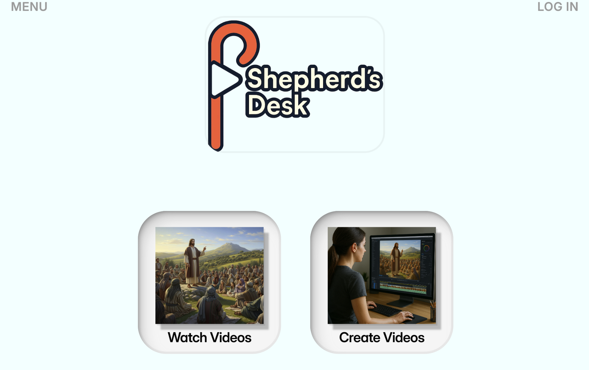
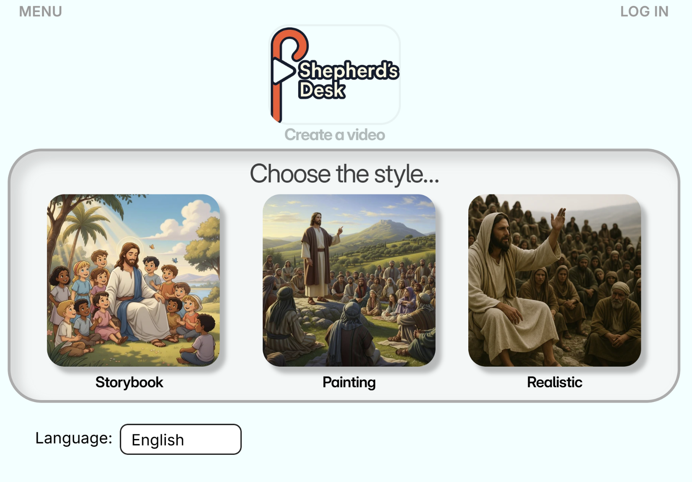

<table>
  <tr>
    <td width="180" valign="top">
      
    </td>
    <td valign="top">
      <h1>Shepherd’s Desk</h1>
      <p><em>Guiding Media Toward Meaning</em></p>
      <p><strong>What it is:</strong> a faith‑driven media pipeline that turns ideas into short videos. It orchestrates an LLM “script” → speech → images → optional image‑to‑video → final edit. Built with the <a href="https://www.gloo.us/">Gloo API</a> to encourage Christ‑centered creation over passive scrolling.</p>
    </td>
  </tr>
</table>

<p align="center">
  <a href="#quickstart">Quickstart</a> •
  <a href="#recipes">Recipes</a> •
  <a href="#arguments">Arguments</a> •
  <a href="#project-layout">Project layout</a> •
  <a href="#web-ui-preview-wip">Web UI (WIP)</a>
</p>

---

## Pipeline
1. **Script** — Generate a JSON “movie script” with <strong>Gloo</strong>.
2. **Voices** — Per‑clip dialogue with <strong>ElevenLabs</strong> (or <strong>Piper</strong> locally).
3. **Images** — Create frames via <strong>Google Gemini Flash</strong> (or <strong>Stable Diffusion</strong> locally).
4. **Img→Vid (optional)** — Animate each image with <strong>Veo Fast</strong> for low cost.
5. **Edit** — Stitch with <strong>MoviePy</strong>, write <code>.mp4</code> and subtitles <code>.srt</code>.

Open‑source fallbacks are supported: **Stable Diffusion** for images and **Piper** for TTS.

---

## Quickstart

> Requires **Python 3.10+** and **ffmpeg** in PATH.

```bash
# 1) Clone
git clone https://github.com/mdow86/shepherds-desk.git
cd shepherds-desk

# 2) Create venv
python -m venv venv
# Windows
venv\Scripts\activate
# macOS/Linux
# source venv/bin/activate

# 3) Install
pip install -U pip
pip install -r requirements.txt
```

### Configure credentials
Set these as env vars (or in a `.env` file). Provide only what you use.

- `GLOO_API_KEY` — LLM script generation.
- `ELEVENLABS_API_KEY` — TTS.
- One of `VEO_API_KEY` / `GEMINI_API_KEY` / `GOOGLE_API_KEY` — Gemini/Veo.
- Optional: Google Cloud Translation creds if you translate (the pipeline auto‑translates Gloo JSON before TTS).

---

## Recipes

Each command shows **why** you’d run it.

### 1) Full video in **Spanish** (image generation + ElevenLabs + img→vid + compose)
```bash
python ./src/media_generator/orchestrate.py \
  --img gemini --tts elevenlabs --style-preset photo \
  --source veo --language spanish --clips 6
```
Why: generate images with **Gemini Flash**, convert **Spanish** script to audio with **ElevenLabs**, animate with **Veo Fast**, then compose.

### 2) Slideshow with selected clips, in **Spanish** (no img→vid)
```bash
python ./src/media_generator/orchestrate.py \
  --img gemini --tts elevenlabs --style-preset oil \
  --source images --language spanish --clips 3
```
Why: keep costs minimal by skipping img→vid. Uses images only and overlays TTS timing. Limited to first **3** clips.

### 3) Already have images and audio, just compose
```bash
python ./src/media_generator/orchestrate.py \
  --skip-img --skip-tts --style-preset storybook \
  --source images --language japanese --clips 1
```
Why: reuse existing `outputs/images/clip*.png` and `outputs/audio/clip*.{mp3|wav}`. Writes the final video only.

### 4) Set the number of clips for a simple slideshow
```bash
python ./src/media_generator/orchestrate.py \
  --clips 9 --img gemini --tts elevenlabs \
  --style-preset photo --source images
```
Why: images only, **9** clips, with ElevenLabs narration.

### 5) Compose only from existing Veo clips (skip everything else)
```bash
python ./src/media_generator/orchestrate.py --only video --source veo --clips 2
```
Why: you already ran img→vid; this stitches `outputs/video_veo/clip{N}.mp4` into a final video.

> Tip: To explicitly skip img→vid in a veo pipeline, add `--skip-img2vid`, or switch to `--source images` to do a slideshow.

---

## Arguments

| Flag | Values | Purpose |
|---|---|---|
| `--only` | `gloo`, `translate`, `tts`, `img`, `img2vid`, `video` | Run just one stage |
| `--skip-*` | `--skip-gloo`, `--skip-translate`, `--skip-tts`, `--skip-img`, `--skip-img2vid`, `--skip-video` | Skip stages |
| `--img` | `gemini`, `sd` | Images with **Gemini Flash** or local **Stable Diffusion** |
| `--tts` | `elevenlabs`, `piper` | TTS with **ElevenLabs** or local **Piper** |
| `--source` | `images`, `veo` | What the composer consumes: a slideshow from images, or Veo img→vid clips |
| `--clips` | integer | Use the first N clips from `plan.json` |
| `--style-preset` | `storybook`, `oil`, `photo` | Visual guidance for generators |
| `--language` | `english`, `spanish`, `japanese` | Script and TTS language; adding more is trivial |

Cost control: prefer `--source images` or `--skip-img2vid` to avoid video‑gen costs. Veo Fast is cheaper than high‑quality variants but still non‑zero.

---

## Project layout
```
src/media_generator/
  orchestrate.py            # pipeline controller
  gen_llm_gloo.py           # script generation (Gloo)
  gen_tts_11labs.py         # ElevenLabs TTS
  gen_img_gemini.py         # Gemini Flash image generation
  gen_img2vid_veo.py        # Veo Fast image→video (optional)
  gen_vid_moviepy.py        # final compositor (.mp4 + .srt)
  outputs/                  # plan.json, images/, audio/, video_veo/, video/

# Optional local engines
  gen_tts_piper.py          # Piper (local, free) TTS
  gen_img_sd.py             # Stable Diffusion (local, free) images
```
- **ElevenLabs** → high‑quality cloud voices.  
- **Gemini Flash** → fast, low‑cost image generation.  
- **Veo Fast** → low‑cost img→vid animation.  
- **Piper** → local TTS (free). <a href="https://github.com/rhasspy/piper">Piper on GitHub</a>  
- **Stable Diffusion** → local image generation (free). <a href="https://github.com/CompVis/stable-diffusion">CompVis</a> • <a href="https://github.com/AUTOMATIC1111/stable-diffusion-webui">Auto1111 UI</a>

---

## Web UI preview (WIP)

The frontend is not yet connected to a backend or database.

<table align="center">
  <tr>
    <td align="center"><strong>Landing Page</strong></td>
    <td align="center"><strong>Video Creation Page</strong></td>
  </tr>
  <tr>
    <td></td>
    <td></td>
  </tr>
</table>

---

## Acknowledgments
- <a href="https://www.gloo.us/">Gloo API</a> for script generation.
- <a href="https://elevenlabs.io/">ElevenLabs</a> for TTS.
- <a href="https://ai.google.dev/gemini-api">Google Gemini</a> for images (Flash) and <a href="https://ai.google.dev/gemini-api/docs/models/veo">Veo</a> for img→vid.
- <a href="https://zulko.github.io/moviepy/">MoviePy</a> for editing.
- Optional: <a href="https://github.com/rhasspy/piper">Piper</a>, <a href="https://github.com/CompVis/stable-diffusion">Stable Diffusion</a>.

---

**Status:** Work in progress. Issues and PRs welcome.
